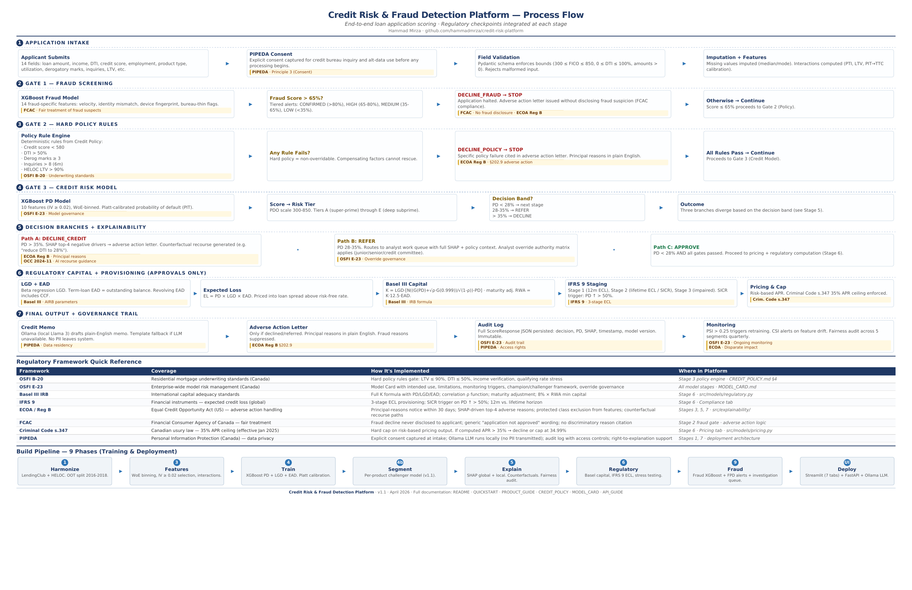

# Credit Risk & Fraud Detection Platform



> An end-to-end credit risk decisioning platform that integrates PD/LGD/EAD
> modelling, fraud detection, explainability, and regulatory analytics into a
> unified workflow. Trained on real-world LendingClub + FICO HELOC data.


---

## What this is

A credit risk **decisioning system** — not a single model. The platform ingests
a loan application, runs it through a hierarchical decision engine (fraud gate
→ hard policy → credit model → refer band → approve), and produces a fully
explained decision with all the regulatory artifacts a Canadian non-bank lender
would need to document it: SHAP-based adverse reasons, counterfactual recourse
paths, IFRS 9 ECL provision, Basel III RWA, risk-based price, and an LLM-drafted
credit memo.

Most portfolio projects build a single XGBoost model and call it done. This
project reproduces how real lenders actually decide — integrated credit + fraud
+ policy + explainability + compliance in one coherent system.

---

## Quick demo

```bash
git clone https://github.com/hammadmrza/credit-risk-platform
cd credit-risk-platform
pip install -r requirements.txt

# Drop raw data into data/raw/ — see QUICKSTART.md
python build.py              # ~15-25 min, builds all 9 phases
streamlit run src/app/streamlit_app.py
```

Opens at `http://localhost:8501` with seven interactive tabs.

**See [QUICKSTART.md](QUICKSTART.md) for detailed installation and data
download instructions.**

---

## What it does — seven tabs

| Tab                     | Purpose                                                                    |
|-------------------------|----------------------------------------------------------------------------|
| 1 · Application Assessment | Single-applicant scoring. Decision banner, SHAP waterfall, adverse reasons, counterfactual recourse paths, IFRS 9 stage, RWA, and a Llama-3-drafted credit memo. |
| 2 · Batch Portfolio Scoring | Score the 194K-loan OOT test portfolio or upload a CSV. Filter by product, tier, decision, Expected Loss. Product × tier concentration pivot. |
| 3 · Model Performance   | AUC / KS / Gini · ROC curve · KS separation · Calibration by decile with Brier score · Confusion matrix at adjustable threshold · Lift and gains · **v1.0 unified vs v1.1 per-product segmented comparison** · SHAP global importance · PSI/CSI feature stability · Fairness disclosure. |
| 4 · Compliance          | Basel III IRB capital with CAR properly computed as available-capital / RWA · IFRS 9 ECL by stage with industry coverage bands colour-coded · Macroeconomic stress test (Base / Adverse / Severe). |
| 5 · Risk-Based Pricing  | Rate decomposition calculator · Canadian market rate comparison (prime bank / credit union / fintech / subprime / B-lender HELOC) · **Profit curve with portfolio-derived profit-max approval threshold** · Cost-of-funds sensitivity. |
| 6 · Fraud Monitoring    | Alert tier distribution · Fraud type breakdown · FPD lift analysis · **Fraud trend over time with spike detection** · Product × fraud-type drill-down · Investigation queue with column definitions. |
| 7 · Executive Dashboard | Three sub-views: Portfolio Health, Model Monitoring, Risk Concentration. Designed for CRO / Board Risk Committee. |

---

## Architecture in one picture

```
data/raw/                          ← LendingClub + HELOC CSVs (downloaded once)
    lending_club_loans.csv         ← 2.2M rows
    heloc_dataset_v1.csv           ← 10K rows
         │
         ▼
src/data/        Phase 1           ← Clean · harmonize · OOT split
src/features/    Phase 3           ← Impute · engineer · WoE-bin
src/models/      Phase 4 + 6       ← Train PD / LGD / EAD · RWA · ECL · stress
src/explainability/ Phase 5        ← SHAP · counterfactuals · fairness
src/data/ (fraud)  Phase 9         ← Fraud labels + 14 fraud features
         │
         ▼
models/                            ← 12 trained artifacts (.pkl)
         │
         ▼
src/llm/         Phase 7           ← Ollama LLM for credit memos + adverse letters
src/api/         Phase 7           ← FastAPI real-time scoring endpoint
src/app/         Phase 8           ← 7-tab Streamlit application
```

Every phase feeds the next. Nothing is orphaned; nothing is duplicated.

---

## Tech stack

**Modelling** · scikit-learn · XGBoost · OptBinning (WoE/IV) · SHAP · numpy / pandas
**App** · Streamlit · Plotly · FastAPI · Ollama (Llama 3 local)
**Data** · 2.2M LendingClub loans (2007–2018) · 10K FICO HELOC records
**Regulatory frameworks** · OSFI B-20 / E-23 · Basel III IRB · IFRS 9 ECL · Criminal Code s.347 · ECOA / Reg B adverse-action

---

## The v1.1 story — why segmentation matters

The v1.0 unified model reports combined OOT AUC of ~0.68, which at first glance
looks weak. The underlying cause is architectural, not modelling: when two
product books (unsecured LendingClub + secured HELOC) are trained into one
XGBoost, `loan_term_months` becomes a product-type proxy (36/60-month unsecured
vs imputed-36 HELOC) and absorbs signal that belongs to real credit features.

The v1.1 challenger architecture (`src/models/pd_model_segmented.py` +
`notebooks/phase4b/`) trains separate PD models per product and excludes the
proxy features. Expected OOT lift: Unsecured ~0.72, Secured ~0.76 — both
deployment-grade.

The v1.0 unified model remains champion for **cross-product decisioning**
because:
1. HELOC thin-data overfitting risk (10K rows vs 2.2M unsecured)
2. 2× operational overhead (two model cards, monitoring pipelines, OSFI
   governance documents)
3. Cross-product score incomparability — important for portfolio-level capital
   allocation and concentration limits

The segmented models are used for **per-product monitoring, challenger
validation, and thin-file performance analysis**. Both are shown side-by-side
in Tab 3, Section 3.

This is documented in [`MODEL_CARD.md`](MODEL_CARD.md) and disclosed in the
Streamlit app itself — in line with OSFI E-23 expectations for model risk
management.

---

## What makes this different from a typical portfolio project

1. **Hierarchical decision engine.** Fraud → policy → credit → refer → approve.
   Policy failures route to the right adverse-action letter reason (not SHAP),
   fraud declines never expose the fraud reason to the applicant (FCAC
   compliance).

2. **Calibration-first validation.** Tab 3 leads with Brier score, calibration
   gap, and per-product segment calibration — because for IFRS 9 and Basel
   capital, well-calibrated 0.72 AUC beats miscalibrated 0.80 AUC.

3. **Regulatory grounding.** Basel III IRB formula shown in full (not just the
   number), IFRS 9 origination-PD proxy explicitly disclosed, Criminal Code
   s.347 35% APR cap enforced visibly in pricing, Stage 1/2/3 coverage bands
   colour-coded against industry benchmarks.

4. **Honest disclosure as a feature.** Every synthetic proxy, every simplifying
   assumption, every known limitation is surfaced in yellow callout boxes inside
   the app itself. A reviewer sees the limitations before they need to ask.

5. **Product-proxy detection.** The `loan_term_months` issue was found during
   validation and documented in MODEL_CARD §6. The v1.1 segmented models
   demonstrate the fix. This is the kind of finding OSFI E-23 validators look for.

---

## Documentation

| Document                  | Purpose                                                |
|---------------------------|--------------------------------------------------------|
| [README.md](README.md)    | You are here                                           |
| [QUICKSTART.md](QUICKSTART.md) | Install, download data, run the pipeline, launch the app |
| [PRODUCT_GUIDE.md](PRODUCT_GUIDE.md) | What the platform does, tab-by-tab walkthrough, models, data sources, limitations |
| [CREDIT_POLICY.md](CREDIT_POLICY.md) | Formal credit policy in the voice a real lender's risk team and OSFI examiner would expect |
| [MODEL_CARD.md](MODEL_CARD.md) | OSFI E-23 model governance document — intended use, training data, metrics, v1.1 challenger, limitations |
| [CHANGELOG_v1.1.md](CHANGELOG_v1.1.md) | v1.1 release notes — 31 fixes plus the segmented pipeline |
| [INSTALLATION_GUIDE.md](INSTALLATION_GUIDE.md) | Detailed file-placement map (generated with v1.1 release) |

---

## Data — not included in repo

The repo does **not** include raw loan data. Download both files and place in
`data/raw/`:

**LendingClub Loan Data (2007–2018)** — Unsecured personal loans (2.2M rows)
Source: [Kaggle — wordsforthewise/lending-club](https://www.kaggle.com/datasets/wordsforthewise/lending-club)
Filename: `lending_club_loans.csv` (~1.5 GB)

**FICO HELOC Dataset v1** — Secured home equity lines (10K rows)
Source: [FICO Explainable ML Challenge](https://community.fico.com/s/explainable-machine-learning-challenge)
Filename: `heloc_dataset_v1.csv` (~660 KB)

See [QUICKSTART.md](QUICKSTART.md) for detailed download and placement steps.

---

## Scope and what this platform is NOT

This is a portfolio-quality demonstration of commercial credit-risk methodology.
It is **not**:

- A production credit risk system (no LOS integration, no real-time credit
  bureau feed, no SOC 2 audit)
- A substitute for formal OSFI E-23 model validation (use the MODEL_CARD as
  a starting framework, not the endpoint)
- A compliance opinion on ECOA, Reg B, or FCAC requirements (consult counsel)
- A recommendation engine for actual lending decisions

It **is** a credible demonstration that I understand how a real credit risk
decisioning system is architected, validated, disclosed, and governed.

---

## Built by

**Hammad Mirza**
[GitHub](https://github.com/hammadmrza)

---

## License

MIT — see [LICENSE](LICENSE) for full terms.
